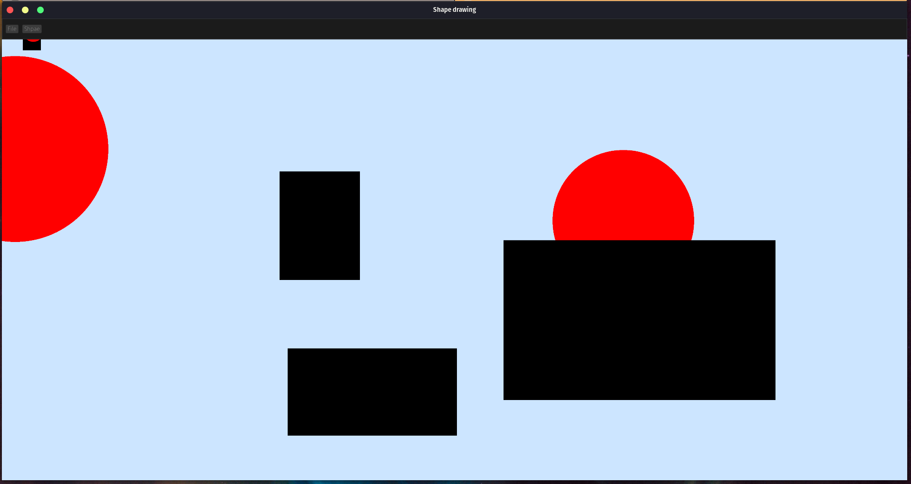

# Simple shape drawing program written in Rust

A course work for a program that can draw rectangles and circles and having the capability to save and load files.

It was testet on Pop!_OS 22.04 LTS and Windows 10

# How to use

Select the shape you want from the "Shape" dropdown. 
Depending on the shape, the mouse presses will function:
- Recrangle -> First mouse press is for the upper left corner, the second for the lower right;
- Circle -> First mouse press is for the center, the second for the radius;

# Libraries

- [simple\_logger](https://crates.io/crates/simple_logger)
    
- [speedy2d](https://crates.io/crates/speedy2d)
    
- [egui\_speedy2d](https://crates.io/crates/egui_speedy2d)
    
- [egui](https://crates.io/crates/egui)
    
- [rfd](https://crates.io/crates/rfd)
    

# Screenshot
